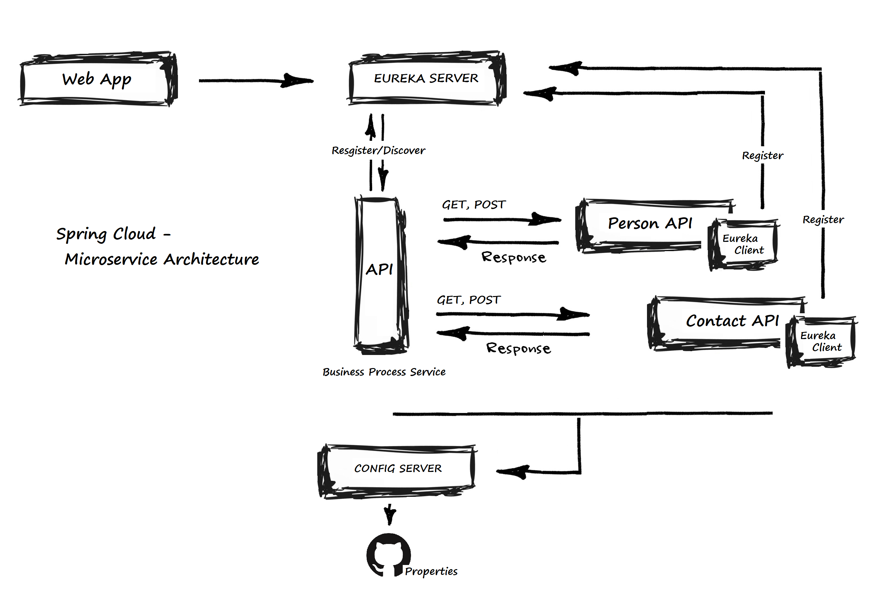
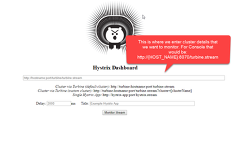

# Spring Cloud Microservice


## What was built
Spring Cloud Microservices using external configurations, discover and consume services, and isolate from failure with the circuit breaker pattern

- Actuator - Expose operational information about the running application
- [Swagger.io](https://swagger.io) - Documentation from the API
- [Eureka Netflix](https://github.com/Netflix/eureka/wiki/Eureka-at-a-glance) - REST based Service Discovery 
- [Spring Cloud OpenFeign](https://cloud.spring.io/spring-cloud-openfeign/single/spring-cloud-openfeign.html) - Declarative REST Client
- Hystrix - Circuit Break pattern
- Hystrix Dashboard

## What you'll need

Java 1.8

Maven 3.0+

## Instructions
Import the project from GitHub

Build and Execute script to startup all services
```
mvn clean package && ./run.sh
```

## Config Server
Configuration server for Spring Cloud that provides all config properties from Git

When the Config server is up and running, visit http://localhost:8888/personservices/default to see the exposed properties configuration

## Eureka server
Service discovery for Microservices

When the Eureka server is up and running, visit http://localhost:8761 to see the list of exposed applications registered with Eureka

## Person services
A set of services to provide data access to Person

When the service is up and running, visit http://localhost:8001 to see the API documentation using Swagger2 with the list of exposed endpoints

## Person contact services
A set of services to provide data access to Contact info

When the service is up and running, visit http://localhost:8003 to see the API documentation using Swagger2 with the list of exposed endpoints

## Person business services
A set of services to consume Person services from Eureka Server with Feign 

When the service is up and running, visit http://localhost:8002 to see the API documentation using Swagger2 with the list of exposed endpoints

### Hystrix Dashboard
Visit http://localhost:8002/hystrix, type in the text box: http://localhost:8002/actuator/hystrix.stream and click on "Monitor Stream"



## Person web app
Web app using Thymeleaf and Bootstrap for creating and display Person entities in the system

When the service is up and running, visit http://localhost:8004/person to see the landing web page
