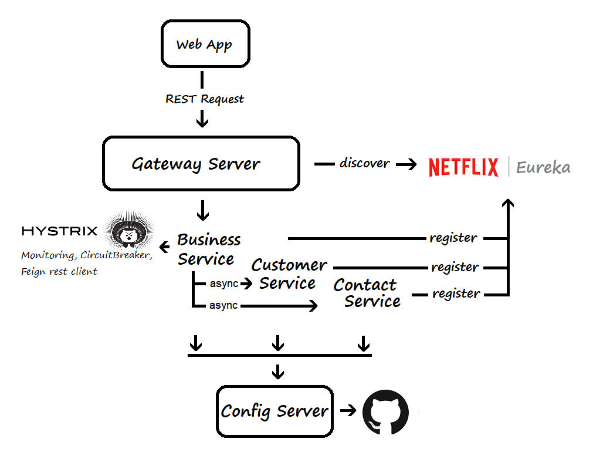

# Spring Cloud Microservice


## What was build
Spring Cloud Microservices using external configurations, discover and consume services, and isolate from failure with the circuit breaker pattern

- Actuator - Expose operational information about the running application
- [Swagger.io](https://swagger.io) - Documentation from the API
- [Eureka Netflix](https://github.com/Netflix/eureka/wiki/Eureka-at-a-glance) - REST based Service Discovery 
- [Spring Cloud OpenFeign](https://cloud.spring.io/spring-cloud-openfeign/single/spring-cloud-openfeign.html) - Declarative REST Client
- Hystrix - Circuit Break pattern
- Hystrix Dashboard

## What you'll need

Java 1.8

Maven 3.0+

## Instructions
Import the project from GitHub

## Config Server
Configuration server for Spring Cloud that provides all config properties from Git

Run config-server
```
cd config-server
mvn spring-boot:run
```

## Test Config server
Now that the Config server is running, visit http://localhost:8888/personservices/default to see the exposed properties configuration

## Eureka server
Service discovery for Microservices

Run eureka-server
```
cd eureka-server
mvn spring-boot:run
```

## Test Eureka server
Now that the server is running, visit http://localhost:8761 to see the list of exposed applications registered with Eureka

## Person services
A set of services to provide data access to Person

Run person-services API
```
cd person-services
mvn spring-boot:run
```

## Test Person services
Now that the API is running, visit http://localhost:8001 to see the API documentation using Swagger2 with the list of exposed endpoints

## Person contact services
A set of services to provide data access to Contact info

Run person-contact-services API
```
cd person-contact-services
mvn spring-boot:run
```

## Test Person contact services
Now that the API is running, visit http://localhost:8003 to see the API documentation using Swagger2 with the list of exposed endpoints

## Person business services
A set of services to consume Person services from Eureka Server with Feign 

Run person-business-services 
```
cd person-business-services
mvn spring-boot:run
```

## Test Person business services
Now that the API is running, visit http://localhost:8002 to see the API documentation using Swagger2 with the list of exposed endpoints

### Hystrix Dashboard
Visit http://localhost:8002/hystrix, type in the text box: http://localhost:8002/actuator/hystrix.stream and click on "Monitor Stream"

 

## Person web app
Web app using Thymeleaf and Bootstrap for creating and searching Person entities in the system

Run person-webapp 
```
cd person-webapp
mvn spring-boot:run
```

## Test Person web app
Now that the Web app is running, visit http://localhost:8004/person to see the landing web page
